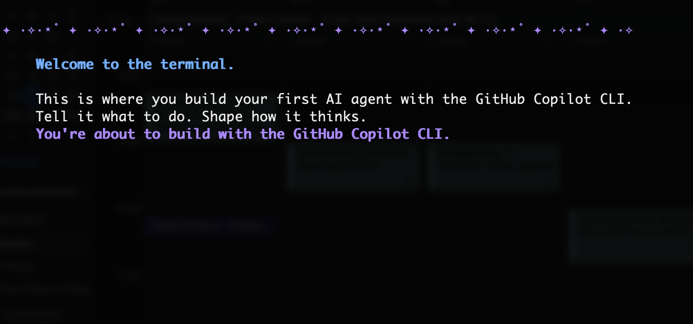
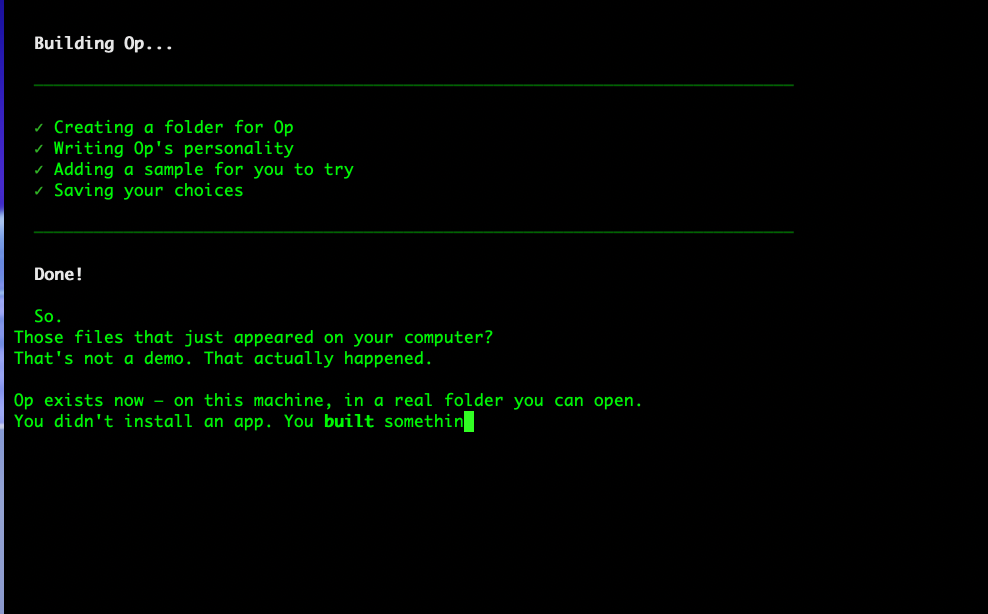
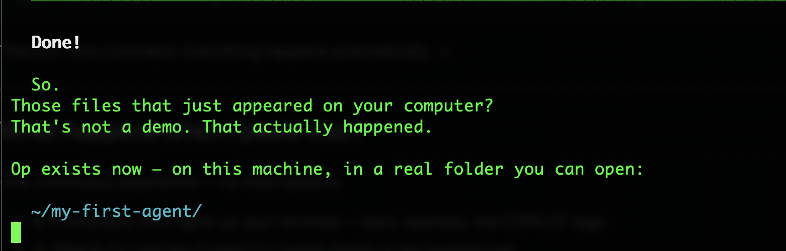
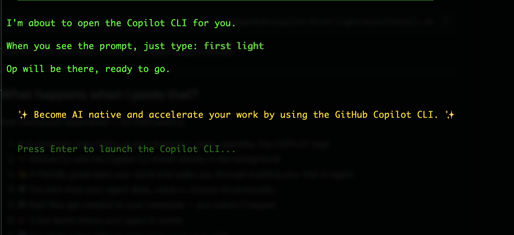
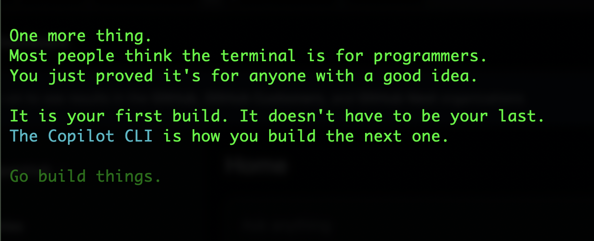

# ✨ Copilot First Light

> Build your first AI agent with the GitHub Copilot CLI in 5 minutes. No coding. No experience needed.

---

## Open your terminal and paste this:

**Mac:** Press `Cmd + Space`, type **Terminal**, press Enter.

**Linux:** Press `Ctrl + Alt + T`.

Then paste:

```
curl -fsSL https://raw.githubusercontent.com/DUBSOpenHub/copilot-first-light/main/install.sh | bash
```

That's it. One command. Everything happens automatically. ✨

---

## What happens when I paste that?

One continuous experience — no interruptions:

1. ✦ A cinematic intro lights up your terminal — stars, sparkles, the COPILOT logo
2. ⚡ GitHub CLI and the Copilot CLI install silently in the background
3. 👋 A friendly guide asks your name and walks you through building your first AI agent
4. 🤖 You pick what your agent does, name it, choose its personality
5. 📁 Real files get created on your computer — you watch it happen
6. 🎯 A live demo shows your agent in action
7. 🌐 You claim a free GitHub account to save your work
8. 🚀 The **Copilot CLI Quickstart** tutorial launches automatically — keep learning

All powered by the GitHub Copilot CLI.

---

## Screenshots

| Welcome | Build | Done |
|---------|-------|------|
|  |  |  |

| Handoff | Quickstart |
|---------|------------|
|  |  |

---

## FAQ

**Do I need to know how to code?** No.

**Will it ask me to install stuff?** No. It handles everything quietly.

**What if I mess up?** You can't. Start over anytime.

**Can I come back later?** Yes. Open your terminal, type `gh copilot`, then type `first light`.

**Is it free?** Yes. You'll need a [Copilot subscription](https://github.com/features/copilot/plans) to use the CLI.

---

*Built for people who've never touched a terminal before. All powered by the GitHub Copilot CLI.*
